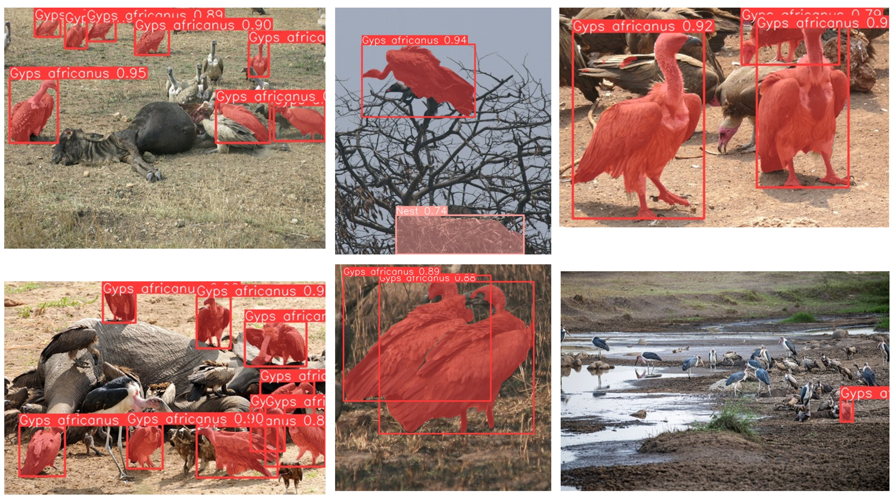

# Computer Vision for White-backed Vulture (_Gyps africanus_) monitoring

## Why Computer Vision for _G. africanus_?
White-backed Vultures (WBV) are an ecologically important scavenger species, but their populations are threatened by habitat loss and human persecution. Monitoring their population and distribution is crucial for conservation efforts. Traditional methods like manual observation are time-consuming and expensive especially in large areas.

This project, my third MSc specific objective proposes using deep learning on images from camera traps and drones to automatically segment and identify WBV within the images. Deep learning   analyze efficiently large datasets of images, making it a promising tool for wildlife monitoring.

## Data Acquisition and Processing
Comprehensive image acquisition and preprocessing were essential to establish a dataset for training the deep learning model. I leveraged two primary sources: iNaturalist (reliable wildlife database), and Google Search. To acces the first source, I built [R script](https://github.com/stangandaho/gyps_africanus_segmentation/tree/main/sources/download_wbv_images.R) that automated the download of WbV images from iNaturalist through [rinat](https://github.com/ropensci/rinat) R package (Barve & Hart, 2022). I set up arguments for the species name, maximum number of results, quality of the image and geographical bounds within Africa to get the data from iNaturalist containing image URLs. I dropped any missing or empty URLs and combined the data into a single dataset. Then the script processed to download images for each unique link in the previous dataset. The second source access consist of use of [Download all Images](https://chromewebstore.google.com/detail/download-all-images/nnffbdeachhbpfapjklmpnmjcgamcdmm) chrome extension. Images were initially stored in separate folders. 
I processed to image quality control removing any unsuitable images. The remaining 3,266 images were consolidated into a single folder, each assigned a unique identifier. Data splitting and meticulous annotation paved the way for effective model training and evaluation. The dataset was partitioned into a training set (60%) for model learning, a validation set (25%) for hyperparameter tuning and overfitting prevention, and a test set (15%) for unbiased performance assessment. Images in the training and validation sets were carefully annotated using [CVAT](https://www.cvat.ai/) (Computer Vision Annotation Tool), an open-source annotation tool. We were able to annotate 588 images in the training data and 240 images in the validation data. In total, I obtained 1,179 WbV and 89 nest instances for model training, and 478 WbV and 11 nest instances for model validation. Annotations were exported in COCO (Common Objects in Context) (Lin et al., 2014) format and subsequently converted to a text file compatible with the YOLO (You Only Look Once) (Jocher et al., 2023; Redmon et al., 2016) model's input requirements. Then we trained the model for 100 epochs, with an image size of 672, batch size of 10, stochastic gradient descent optimizer with a learning rate of 0.001.

## Model use
To make accessible, usable and testable the model, I created an application using [shiny](https://shiny.posit.co/) app that embemded the model. The application can be accessed [here](https://stangandaho.shinyapps.io/Wildfier/) or clone this repository. You can experienced __*504 Gateway Timeout*__. I recommende to clone the [app repository](https://github.com/stangandaho/wildfier) or [download](https://github.com/stangandaho/wildfier/archive/refs/heads/main.zip) and unzip. Go to _wildfier_ folder and click on _wildfier.Rproj_. Make sure you have [R and RStudio](https://posit.co/download/rstudio-desktop/) installed. To run the app, open _ui.R_ or _server.R_ file and click on __Run App__ button.

## References
1. Barve, V., & Hart, E. (2022). rinat: Access “iNaturalist” Data Through APIs (0.1.9). https://cran.r-project.org/package=rinat
2. Jocher, G., Chaurasia, A., & Qiu, J. (2023). Ultralytics YOLO. https://github.com/ultralytics/ultralytics
3. Lin, T.-Y., Maire, M., Belongie, S., Hays, J., Perona, P., Ramanan, D., Dollár, P., & Zitnick, C. L. (2014). Microsoft coco: Common objects in context. Computer Vision--ECCV 2014: 13th European Conference, Zurich, Switzerland, September 6-12, 2014, Proceedings, Part V 13, 740–755. https://doi.org/https://doi.org/10.48550/arXiv.1405.0312
3. Redmon, J., Divvala, S., Girshick, R., & Farhadi, A. (2016). You only look once: Unified, real-time object detection. Proceedings of the IEEE Conference on Computer Vision and Pattern Recognition, 779–788. https://www.cv-foundation.org/openaccess/content_cvpr_2016/html/Redmon_You_Only_Look_CVPR_2016_paper.html  

